## 常用功能
- network功能

按钮从左到右分别是记录、清空、过滤器、查询、保留日志、禁用缓存、设置网络环境、网络加载设置

- 记录: 打开后开始记录所有请求信息. 
- 清空: 清空之前的所有记录信息. 
- 过滤器: 根据用户输入的过滤信息做一些过滤, 支持正则等.
  - `Invert` 反转搜索条件 
  eg: status-code:200

    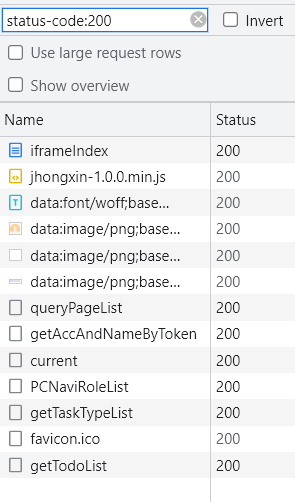
    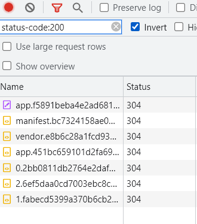
    
  - `WebAssembly` 浏览器字节码 格式文件

  - `Manifest` 缓存优化 格式文件
  
  - `Hide data URLs` 隐藏base 64请求
    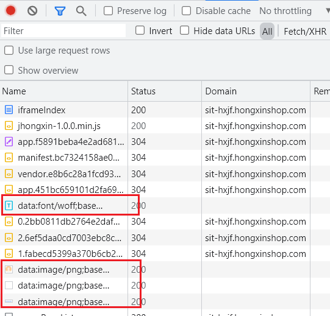
    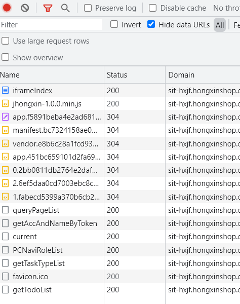
  - `Has blocked cookies`
    响应cookies被阻塞的请求

  - `Blocked Requests`
    过滤出被阻塞的请求
      - 选择某个请求进行阻塞

    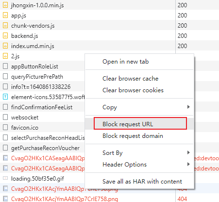

      - 选中复选框
    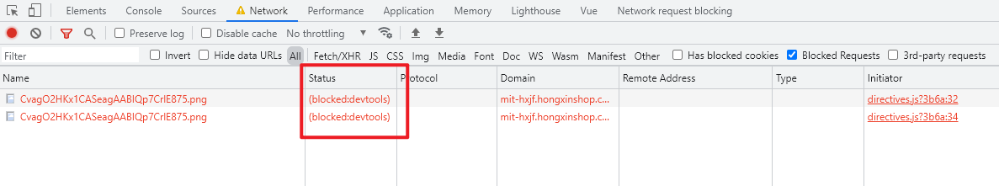

  - 3rd-party requests 第三方的请求（跨域请求）
    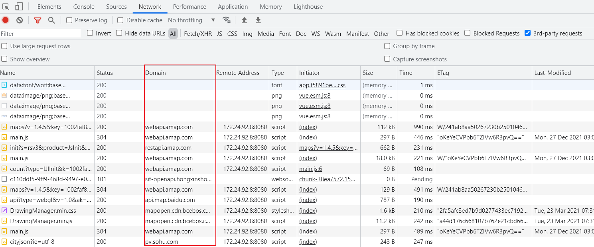
- 查询: 搜索请求的某些信息
- 保留日志:切换域名也能有请求记录，保留日志
- disable cache: 不使用缓存.
- No throttling是用来模拟网络环境的. 比如3g, 4g等, 还有一些自定义网络环境.

- 设置
 
打开设置，从左到右分别是
  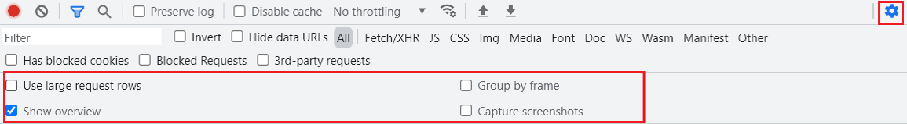
- `Use large request rows` 展示大小图标
  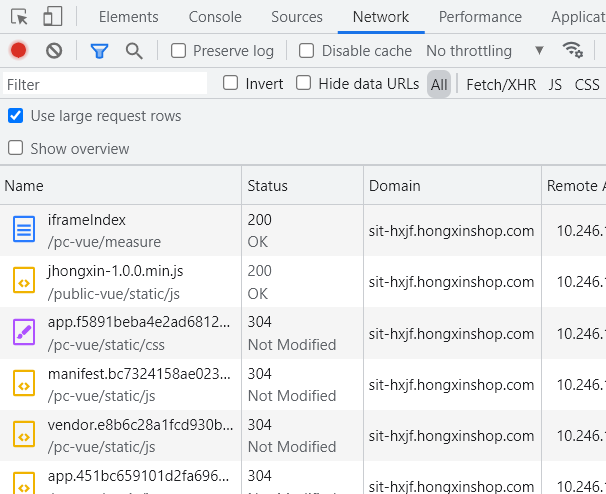
- `Group by frame` 根据iframe, frame等过滤
  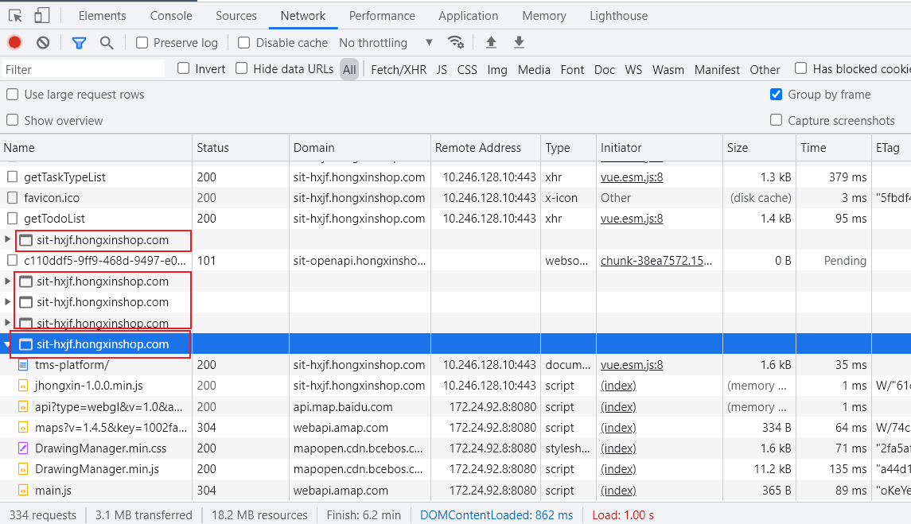
- `Show overview` 展示timeline
- `Capture screenshots` 做一些页面加载中的截图(一般分析首屏加载的时候会用到)

## 常见的请求状态码
- `2XX` 2开头的都表示这个请求成功
- `3XX` 
  - 301 永久重定向
    例如：访问http://www.360buy.com域名永久定向到http://www.jd.com域名
    
  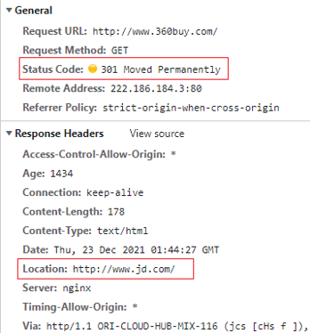

  - 302 临时重定向 例如：访问http://www.360buy.com域名永久定向到http://www.jd.com域名

  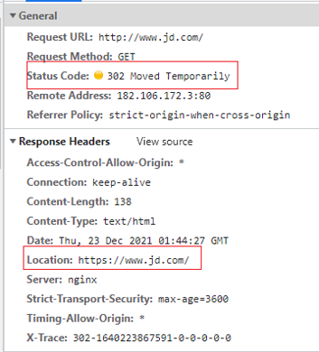

- `4XX` （请求错误）这些状态代码表示请求可能出错，妨碍了服务器的处理
  - 400代表客户端发送的请求有语法错误，
  - 401代表访问的页面没有授权，
  - 403服务器拒绝访问，
  - 404未找到，服务器找不到请求的页面，应用程序没起来也会报

- `5XX` 5开头的代表服务器有异常
  - 500代表服务器内部异常
  - 502错误网关，服务器作为网关或代理，从上游服务器收到无效响应
  - 503服务器不可用，服务器正在维护或者暂停了或cpu占用的频率大导致
  - 504代表服务器端超时，没返回结果

## 常用的响应头及请求头
- 响应头
  - `Expires: Sun, 28 Nov 2021 05:26:33 GMT` HTTP/1.0，返回的缓存的到期时间（格林尼治时间）。如果再次发起该请求时，如果客户端的时间小于Expires的值时，直接使用缓存结果。**如果同时存在cache-control响应头，则expires头会被忽略**
  - `cache-control: max-age=86400` （1天） HTTP/1.1 替代Expires 以秒为单位 设置缓存存储的最大周期，超过这个时间缓存被认为过期。与Expires相反，时间是相对于请求的时间。
  - `ETag: W/"61ba8f0a-b1b7"` 当前资源文件的一个唯一标识(由服务器生成) 与请求头`If-None-Match`配合使用。（协商缓存，更精确）
  - `Last-Modified: Thu, 21 Oct 2021 07:12:43 GMT` 该资源文件在服务器最后被修改的时间。与请求头`If-Modified-Since`配合使用。（协商缓存）
  - `Location` 重定向的新地址
  - `Set-Cookie` 设置HTTP cookie
  - `Content-Type` 响应体的MIME类型
  - `Date` 响应的时间
  - `Content-Disposition` 对已知MIME类型资源的描述，浏览器可以根据这个响应头决定是对返回资源的动作，如：将其下载或是打开。

- 请求头
  - `Pragma: no-cache` HTTP/1.0； 功能和 `Cache-Control: no-cache`相同
  - `Cache-Control: no-cache` HTTP/1.1 强制从本地缓存读取时要先到远程服务器进行验证。
  - `If-None-Match: W/"61ba8f0a-b1b7"` 携带上次请求返回的唯一标识Etag值，通过此字段值告诉服务器该资源上次请求返回的唯一标识值。（If-None-Match 的字段值 = 该资源在服务器的Etag值一致则返回304，代表资源无更新，继续使用缓存文件；不一致则重新返回资源文件，状态码为200）（协商缓存，更精确）
  - `If-Modified-Since` 携带上次请求返回的Last-Modified值，通过此字段值告诉服务器该资源上次请求返回的最后被修改时间。（若服务器的资源最后被修改时间>If-Modified-Since的字段值则重新返回资源，状态码为200；否则则返回304，代表资源无更新，可继续使用缓存文件）
  - `Referer: http://xxx.com/` 当前请求页面的来源页面的地址。实际上是 "referrer" 误拼写。服务端一般用来该请求头识别访问来源，可能会用来进行统计分析、日志记录以及缓存优化等。
  - `Accept-Encoding` 可接受的响应内容的编码方式。
  - `Cookie` 同域请求携带的参数。服务器通过Set-Cookie（见下文）设置的一个HTTP协议Cookie
  - `Host` 服务器的域名以及服务器所监听的端口号
  - `Content-Type` 请求体的MIME类型
  - `User-Agent` 浏览器的身份标识
  

- 第一次请求时

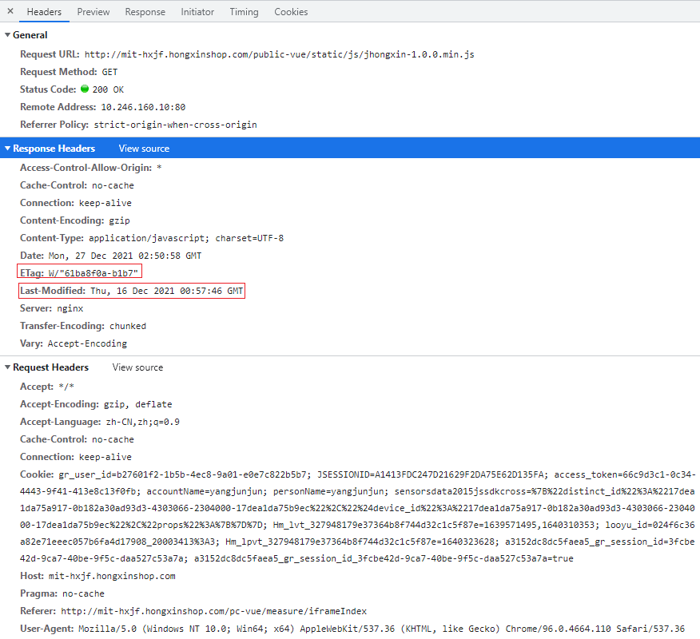

- 第二次请求时

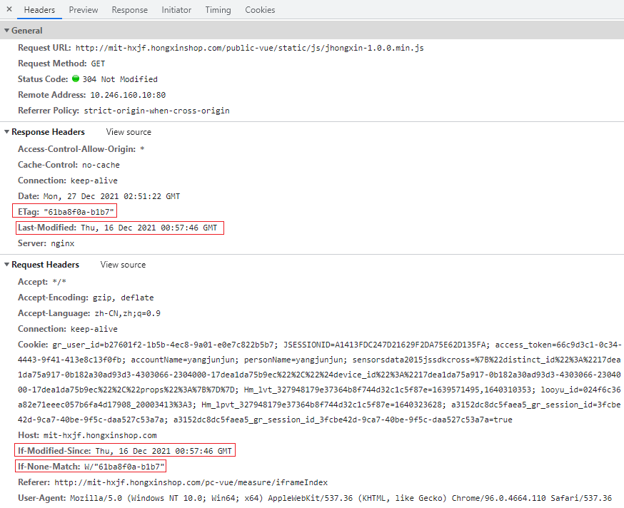

- 缓存图解
  - 第一次请求相同数据
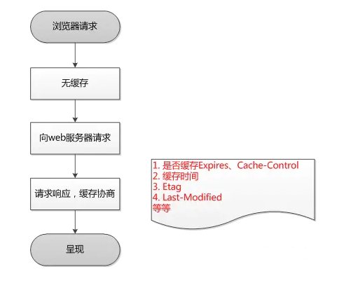
  - 第二次请求相同数据
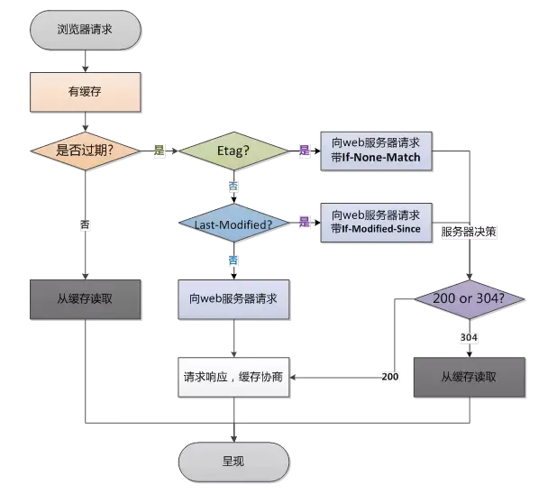

## network Timing 加载过程

- 请求加载全过程，可以分析请求出现的问题
  - `Queueing`：请求排队用时 浏览器是有线程限制的，发请求也不能所有的请求同时发送，会将请求加入队列中（Chrome的最大并发连接数是6）

  - `Stalled`：阻塞时间 浏览器对同一个主机域名的并发连接数有限制，因此如果当前的连接数已经超过上限，那么其余请求就会被阻塞；

    优化措施：
    1、将资源合理分布到多台主机上，可以提高并发数；
    2、脚本置于页面底部；

  - `Request send`：发送请求用时

    优化措施：
    1、减少HTTP请求，可以合并脚本和样式表等；
    2、对不常变化的类库添加强缓存，再次访问可以避免不必要的HTTP请求；

  - `Waiting(TTFB)`：服务器响应时间

    优化措施： 使用CDN，将用户的访问指向距离最近的工作正常的缓存服务器上，由缓存服务器直接响应用户请求，提高响应速度；

  - `Content Download`：收到响应的第一个字节，到接受完最后一个字节的时间，下载时间

    优化措施：
    1、使用协商缓存，减小响应的次数；
    2、移除重复脚本，精简和压缩代码；
    3、服务器端启用gzip压缩响应内容，可以减少下载时间；

    数据下载时间长则有可能是数据较大，或者网络带宽比较慢
  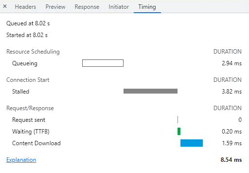

## 辅助调试篇

### 切换手机设备调试工具栏
  
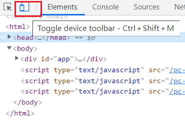

- Show device frame：展示手机外壳、更加有代入感
- Show media queries：打开媒体查询调试模式
- Show rulers：打开像素标尺
- Capture screenshot：可视界面截屏
- Capture full size screenshot：截网页全屏
- Reset to defaults：重置到默认设置
- Close DevTools：关闭调试模式

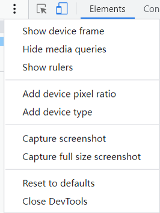

### 快速重新加载

- 右键saas网页中 [重新加载框架]，会重新加载一遍网页，在前端发版时，不需要重新刷新网页，更加快捷和方便

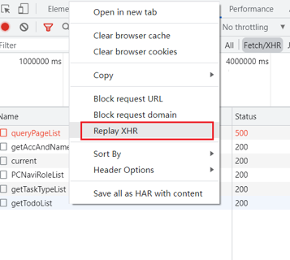

- 右键saas网页中 [重新加载框架]，会重新加载一遍网页，在前端发版时，不需要重新刷新网页，更加快捷和方便

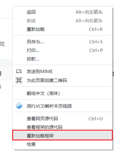

### 获取加载图片的base64

在资源面板中筛选Img

右键单击将其复制为数据URI（已编码为base 64）

开发时有时候会用到

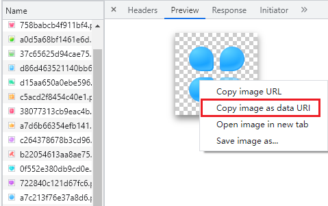
### 存储数据查看

- 浏览器本地存储
  - `Local Storage`：前端开发用来存储数据；请求不携带；永久存储，只能手动清空；
  - `Session Storage`：前端开发用来存储数据；请求不携带；关闭浏览器就清空存储的数据；

- 请求携带数据存储
  - `Cookies`
    - 右键可以直接编辑、可以点上方进行排序，方便调试；
    - 前端可以读写、请求接口时可以携带；
    - 请求接口的响应头set-cookies也可以写入cookies数据
    - 常用来请求接口时携带用户的登录数据

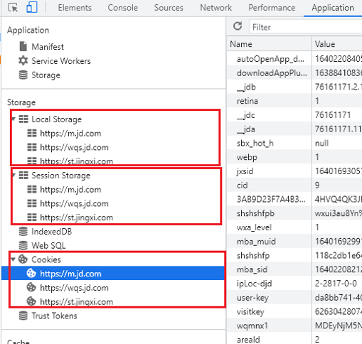

### 命令篇

按Ctrl + Shift + P打开“命令”菜单。
- `Capture full size screenshot` 全屏截图
- `Capture node screenshot` 截取特定节点（长截屏）
- `Capture area screenshot` 自定义区域截屏
- `Capture screenshot` 当前可见区域截屏

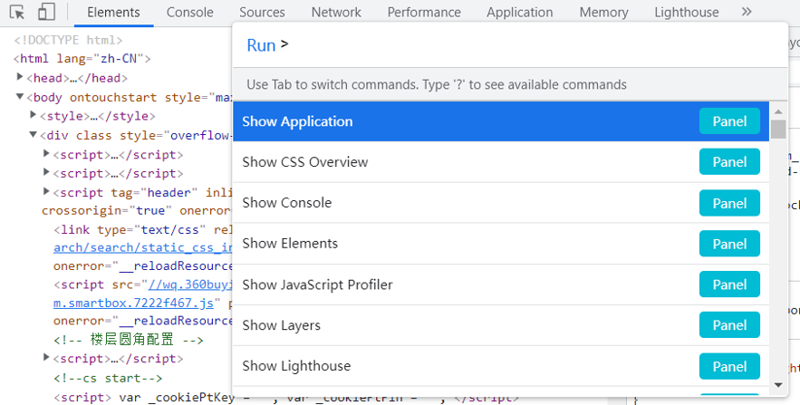